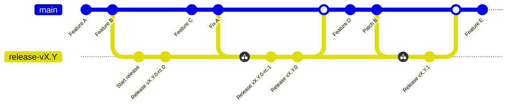

<!-- Template: replace every {{...}} placeholder, then delete this comment. -->

# Releasing

{{Project name}} uses an automated release process that compiles, packages and publishes the
library from a clean CI environment (GitHub Actions), implemented in the
[`{{release-workflow}}.yml`](.github/workflows/{{release-workflow}}.yml) workflow. Automating it
reduces the potential for human error and keeps releases consistent and reproducible.

Releases are cut by maintainers. Contributors do not need to run any of this — record your
user-facing change under `## Unreleased` in [`CHANGELOG.md`](CHANGELOG.md) as described in
[`CONTRIBUTING.md`](CONTRIBUTING.md), and the release process picks it up.

## Changelog automation

{{How CHANGELOG.md is assembled — e.g. Changesets, or promoting the `## Unreleased` section to
a version heading on release. Each change relevant to consumers is expected to carry an entry.}}

## Branching model

The release cycle happens on release branches called `release-vX.Y`. Each of these branches
starts as a release candidate (rc) and is eventually promoted to final.

A release branch can be updated with cherry-picked patches from `main`, or may sometimes be
committed to directly in the case of old releases. These commits lead to a new release
candidate or a patch increment depending on the state of the release branch.

## Promoting a release candidate to final

{{The command, workflow dispatch, or label that promotes the current rc on `release-vX.Y` to a
final release.}}

## What publishes the packages

{{Which workflow publishes, what it publishes to (the registry / package manager), and which
credentials or environment it needs. Name the tag or event that triggers it.}}

> [!IMPORTANT]
> Consumers must install from tagged releases, never from `main` — the release process involves
> security measures the development branch does not guarantee.
